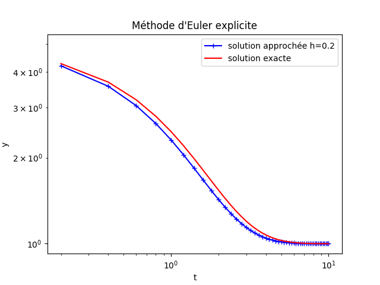
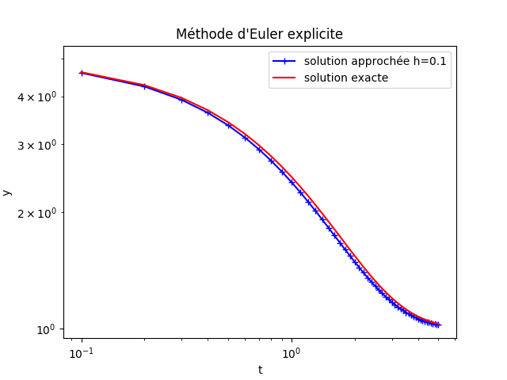
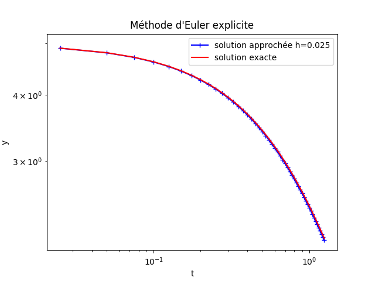
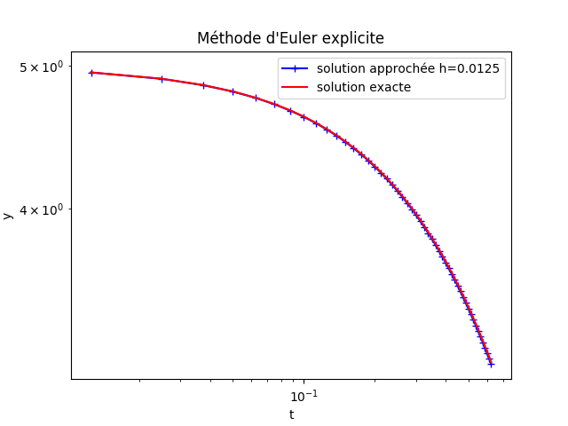
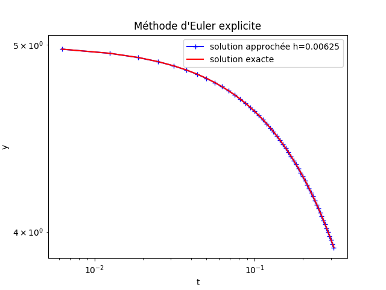

**Nom/Prénom : VANHATALO Tara**
# Rapport TP1
## Séance 1, partie 1
 1. Je choisi d'utiliser emacs et ipython.
 2. bla bla de la 2e question
 3. README.md, CR.md sont des fichiers Markdown. ecran01.png est un fichier image qui est en réfèrence dans README.md. Et les fichiers *.py sont des fichiers Python.
## Séance 1, partie 2
 | h            | Erreur                 |
 | ------------ | ---------------------- |
 | 0.2          | 0.07551365552911607    |
 | 0.1          | 0.03677446949454351    |
 | 0.05         | 0.01816318138330468    |
 | 0.025        | 0.008418740234395273   |
 | 0.0125       | 0.0026797528619485543  |
 | 0.00625      | 0.0007305381751976648  |
 
 
 
 
 
 
 
 
